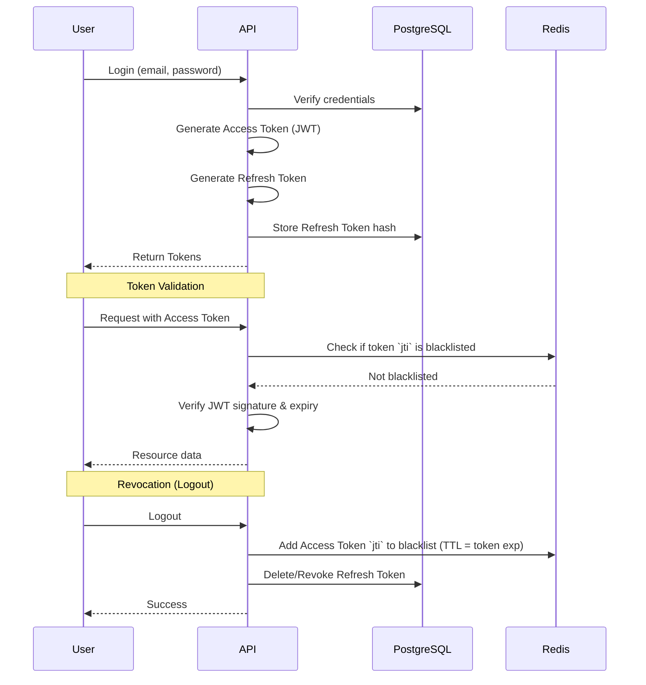

# Amber Authentication System Architecture

## 1. Authentication Architecture Overview

Amber's authentication system is designed to secure an autonomous incident remediation engine that handles sensitive infrastructure credentials and automated responses. The architecture is built around a self-hosted JWT (JSON Web Token) model, integrating tightly with a PostgreSQL database for persistent identity and a Redis cache for real-time token revocation.

This hybrid approach allows stateless verification for internal service communication while maintaining strict control over token lifecycles—a critical requirement when dealing with SRE automation and infrastructure access.

## 2. Why JWT + Redis Revocation

### Decision: Self-hosted JWT for V1
For V1, Amber uses self-hosted JWTs with Redis-backed revocation rather than a session-based model or a third-party OAuth2 provider (like Auth0 or Clerk). 
* **Control & Data Sovereignty:** Critical for a product interacting with sensitive infrastructure. It enables full on-premise or VPC deployments for enterprise customers without external dependencies.
* **Stateless Verification:** Microservices can verify JWTs locally without database lookups, reducing latency during high-stakes incidents.
* **Redis Revocation:** Provides the security of stateful sessions (immediate invalidation) with the scalability of stateless JWTs.

### Future: OAuth2/OIDC Provider
As the platform scales to enterprise tiers, we will integrate OAuth2/OIDC for single sign-on (SSO), allowing organizations to use their existing IdPs (Okta, Azure AD). The core JWT architecture will remain as the internal token exchange mechanism.

## 3. Token Architecture

Amber implements a three-token architecture to balance security and usability.

### Access Token
* **Format:** JWT signed with `HS256` (planned migration to `RS256` as we split into multiple services).
* **Expiry:** 15-30 minutes (`ACCESS_TOKEN_EXPIRE_MINUTES`).
* **Payload claims:** `sub` (user_id), `org_id`, `role`, `permissions`, `jti` (unique token ID), `exp`.

### Refresh Token
* **Format:** Opaque cryptographic string stored hashed in the PostgreSQL database.
* **Expiry:** 7 days (`REFRESH_TOKEN_EXPIRE_DAYS`).
* **Security:** Rotated on every use. Implements family-based rotation to detect and prevent token theft.

### HITL Approval Token (Human-in-the-Loop)
* **Format:** Single-use JWT or opaque token bound to a specific remediation action.
* **Expiry:** 10 minutes (strict TTL).
* **Security:** Cryptographically bound to a SHA-256 hash of the approval payload. Ensures the approval cannot be intercepted and replayed for a different infrastructure action. Used via the SRE Dashboard and Slack integrations.

## 4. Token Lifecycle

## 5. Password Security

* **Hashing Algorithm:** `passlib` implementing `bcrypt` with a work factor of 12.
* **Password Policy:** Minimum 12 characters, requiring upper/lower case, numbers, and symbols.
* **Breach Detection:** Integration with the HaveIBeenPwned API during registration and password reset to prevent the use of known compromised passwords.

## 6. RBAC Model

Amber implements a hierarchical Role-Based Access Control system to restrict access to infrastructure and incident data.

### Role Hierarchy & Permissions

| Role | Description | Key Permissions |
|---|---|---|
| **VP Eng / CTO** | Executive oversight | Global kill switch, audit trails, MTTR analytics, manage billing. |
| **SRE Lead / Staff** | System administrators | Manage runbooks, configure tool allowlists, approve post-mortems for KB, manage users. |
| **On-Call SRE** | Incident responders | View incidents, approve HITL actions, trigger manual rollbacks. |
| **Service Developer**| Service owners | View incidents for owned services, review post-mortems. |

API endpoints enforce these roles via FastAPI dependency injection, mapping JWT claims against the required endpoint permissions.

## 7. Redis Token Revocation

To mitigate the primary weakness of JWTs (inability to revoke before expiry), Amber uses a denylist (blacklist) pattern in Redis.

* **Pattern:** When a token needs early invalidation (logout, password change, permission revocation), its `jti` (JWT ID) is written to Redis.
* **Key Format:** `revoked_token:{jti}`
* **TTL:** The Redis key TTL is set to match the remaining validity of the JWT, preventing Redis memory bloat.
* **Bulk Revocation:** A user-level key prefix allows revoking all active tokens for a user simultaneously (e.g., `revoked_user:{user_id}`).

## 8. API Key Authentication (Webhooks)

External services like PagerDuty, DataDog, and Sentry communicate with Amber via webhooks.
* **Authentication:** HMAC SHA-256 signature verification.
* **Process:** Amber generates a unique webhook secret for each source. The external provider hashes the payload with this secret and sends it via a header (e.g., `X-Webhook-Signature`). Amber verifies the hash before processing the payload.

## 9. Security Headers & Middleware

* **CORS:** Strictly scoped to the frontend origin.
* **CSP:** Content Security Policy implemented on frontend served endpoints.
* **HSTS:** Strict-Transport-Security enforced.
* **Rate Limiting:** IP-based rate limiting via Redis on all `/auth/*` endpoints to prevent brute force and enumeration attacks.

## 10. Threat Model for Auth

| Threat | Mitigation |
|---|---|
| **Credential Stuffing** | IP rate-limiting, account lockout, HaveIBeenPwned API checks. |
| **Token Theft (XSS/MitM)** | Short access token expiry (15m). Refresh tokens stored in HttpOnly cookies (frontend). Refresh token family rotation detects theft. TLS enforced. |
| **Replay Attacks** | Webhook HMAC signatures include timestamps (max 5m drift). HITL tokens are single-use. |
| **Privilege Escalation** | RBAC enforced centrally at the API gateway/middleware level, preventing IDOR or parameter tampering. |
