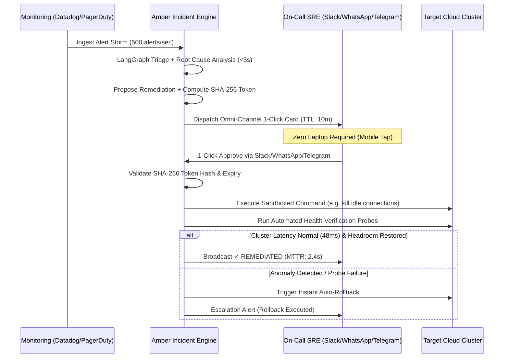

# Amber — Human-in-the-Loop (HITL) Permission & Verification Engine

## 1. Overview & Core Philosophy

Amber eliminates the need for on-call engineers to wake up, open laptops, authenticate via SSO portals, and manually type terminal commands during high-stakes outages. 

Instead, Amber operates on a **Governed Autonomous Model**:
1. **AI Proposes Diagnostics & Fixes:** Agents cluster alert storms, run read-only diagnostics, and generate the exact minimal-blast-radius remediation action.
2. **Deterministic Code Decides Safety:** Mutating actions (HIGH risk) are cryptographically signed into single-use approval tokens.
3. **Omni-Channel Human Confirmation:** The incident proof and 1-click approval button are dispatched directly to the on-call engineer's mobile device (Slack, WhatsApp, Telegram).
4. **Instant Verification & Auto-Rollback:** Once confirmed, Amber executes the action inside the VPC, runs 12 health verification probes, and auto-rolls back if metrics don't recover in ≤ 5 seconds.

---

## 2. Omni-Channel Incident Mesh

Amber dispatches actionable incident cards simultaneously across configured channels:

### A. Slack Interactive BlockKit
* Dispatched to `#sre-critical` or incident-specific triage channels.
* Interactive 1-Click `Approve Action` and `Reject` buttons.
* Expandable Deep Proof drawer containing live diagnostic output, runbook matches, and exact SQL/Kubernetes commands.

### B. WhatsApp Business API
* Dispatched to the on-call engineer's verified mobile number.
* Interactive quick-reply buttons with 2-way webhook verification.
* Ideal for remote or off-laptop SRE dispatch during nighttime P0 incidents.

### C. Telegram Bot Gateway
* Instant push notification with inline interactive callback keyboard.
* Low-latency WebSocket delivery with end-to-end payload signature validation.

---

## 3. Cryptographic Proof & Guardrail Specifications

Every HITL approval token is bounded by three deterministic rules:

1. **Deterministic Risk Stratification:**
   - **LOW Risk (Read-Only):** `query_db_metrics`, `fetch_pod_logs`, `check_service_health`. Executed autonomously under policy without human interrupt.
   - **HIGH Risk (Mutating):** `kill_db_connections`, `rollback_deployment`, `restart_service_pod`. Requires cryptographic human confirmation.
2. **Payload Hash Integrity:**
   - Token contains `payload_sha256 = SHA256(canonical_args)`.
   - The execution runtime verifies that the stored hash matches the inbound request before executing against cloud APIs.
3. **10-Minute TTL & Non-Replay:**
   - Tokens expire automatically after 600 seconds (`approval_expires_at`).
   - Expired tokens cannot be executed under any circumstances.

---

## 4. Automated Post-Execution Health Verification

Execution of a remediation command is only the first half of incident resolution. Amber verifies cluster stability before declaring an incident resolved:

* **12-Point Metric Sweep:** Ingests p99 latency, connection pool saturation, error rates, and CPU/memory metrics from Prometheus/Datadog.
* **Auto-Rollback Trigger:** If error rates exceed baseline or health probes return HTTP 5xx within 5 seconds post-execution, Amber immediately dispatches a pre-computed rollback command.
* **Non-Repudiation Audit Trail:** All diagnostic logs, approval timestamps, approver identity (Slack/WhatsApp handle), and execution outputs are persisted to PostgreSQL and indexed for automated post-mortem generation.
