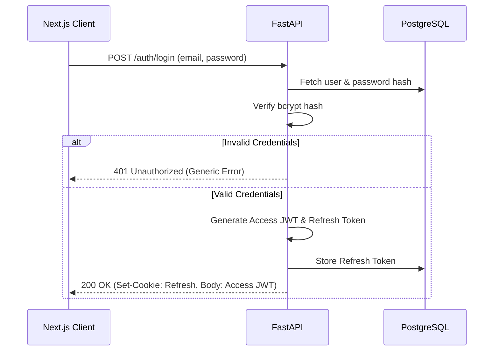

# Amber Login & Session Management

## 1. User Registration Flow

Amber operates as a multi-tenant SaaS. The registration flow is heavily focused on organizational invites rather than open signups, ensuring tight control over access to the remediation engine.

* **Organization Creation:** The first user (e.g., CTO or SRE Lead) creates an organization. Email verification is enforced via an OTP (One-Time Password) or Magic Link sent via email before the organization is activated.
* **Invite Flow:** Team members are invited via email by an Org Admin. The invite link contains a secure, time-limited token. Upon clicking, the user sets their password and is bound to the organization and predefined RBAC role.

## 2. Login Flow

**Security Note:** All authentication errors return generic messages (e.g., "Invalid email or password") to prevent user enumeration attacks. Response timing is standardized using constant-time comparisons.

## 3. Password Reset Flow

1. **Request:** User requests a password reset by providing their email.
2. **Token Generation:** A time-limited, cryptographically secure token is generated and stored in the database with a 15-minute expiry.
3. **Email:** The user receives a link containing the token.
4. **Reset:** User submits a new password along with the token.
5. **Invalidation:** Upon successful reset, the system revokes *all* active sessions for that user by adding their active `jti`s (or a user-wide block flag) to the Redis revocation list and deleting all refresh tokens from the DB.

## 4. Token Refresh Flow

To maintain a seamless UX while utilizing short-lived access tokens, Amber implements a silent refresh flow.

* **Trigger:** The Next.js frontend intercepts 401 Unauthorized responses or proactively detects token expiry.
* **Action:** The client calls `POST /auth/refresh`, sending the HttpOnly refresh token cookie.
* **Rotation:** The API verifies the refresh token, generates a *new* access token and a *new* refresh token, invalidating the old refresh token.
* **Theft Detection:** If a previously used (invalidated) refresh token is presented, the system detects a potential token theft. It instantly invalidates the entire "token family" (all refresh tokens descending from the original login), logging the user out across all devices and triggering a security audit alert.

## 5. Logout Flow

1. Client requests `POST /auth/logout`.
2. The API extracts the `jti` from the current Access Token and adds it to the Redis denylist with a TTL equal to the token's remaining lifespan.
3. The specific Refresh Token provided in the request is deleted from the PostgreSQL database.
4. The client clears local state.
5. **All-Device Logout:** An endpoint `POST /auth/logout-all` allows a user to invalidate all active refresh tokens in the DB and push a user-wide block key to Redis.

## 6. Multi-Factor Authentication (MFA) Roadmap

Given Amber's access to production infrastructure, MFA is mandatory for high-privilege roles.
* **Phase 1 (Current):** Email-based OTP for initial onboarding/critical actions.
* **Phase 2 (Next Quarter):** TOTP implementation (Google Authenticator, Authy).
* **Phase 3 (Enterprise):** WebAuthn/Passkeys for hardware-backed security keys (YubiKey) and biometric authentication.

## 7. Brute Force Protection

Amber protects the login and password reset endpoints against brute force and dictionary attacks.
* **Failed Attempt Counting:** Redis tracks failed login attempts per email and per IP address.
* **Progressive Delays:** After 3 failed attempts, artificial latency is introduced.
* **Account Lockout:** After 10 failed attempts within a 15-minute window, the account is temporarily locked for 30 minutes. An email alert is sent to the user.
* **IP Rate Limiting:** Hard limits on requests to `/auth/*` endpoints per IP (e.g., 20 requests per minute).

## 8. Session Management

While using JWTs, Amber provides session-like management capabilities to the user via the DB-backed refresh tokens.
* **Active Sessions List:** Users can view active sessions (device type, IP address, last active time) in their security settings, populated from the refresh token metadata table.
* **Remote Termination:** Users can revoke specific sessions, deleting the corresponding refresh token and pushing its latest access token `jti` to Redis.

## 9. SSO / Enterprise Auth Roadmap

To support larger engineering organizations, Amber's authentication architecture is designed to accommodate external Identity Providers (IdPs).
* **SAML 2.0 & OIDC:** Future integration path for Okta, Azure AD, and Google Workspace.
* **Just-in-Time (JIT) Provisioning:** When SSO is enabled, users will be provisioned on-the-fly with roles mapped from their IdP groups.
* **Bypass Restrictions:** When SSO is enforced for an organization, standard email/password logins are disabled, routing all auth flows through the IdP.

## 10. Frontend Auth Integration (Next.js)

* **Access Token Storage:** Kept in memory (React context/Zustand) or `localStorage` (if cross-tab persistence is strictly required, though memory is preferred for XSS mitigation).
* **Refresh Token Storage:** Stored exclusively in an `HttpOnly`, `Secure`, `SameSite=Strict` cookie, making it inaccessible to JavaScript.
* **Interceptors:** Axios or Fetch interceptors automatically attach the Access Token to outgoing API requests and handle the silent refresh cycle seamlessly when a 401 occurs.
