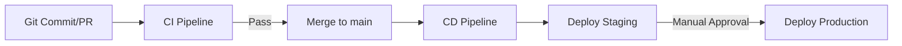

# CI/CD Pipeline

This document details the Continuous Integration and Continuous Deployment (CI/CD) architecture for **Amber**.

## 1. CI/CD Platform

We utilize **GitHub Actions** as our primary CI/CD platform.
- **Why GitHub Actions?** Native integration with our GitHub repository, cost-effective for private repositories, and provides access to a massive marketplace of pre-built actions.

## 2. Pipeline Architecture

## 3. CI Pipeline (On every PR)

When a developer opens a PR or pushes to an existing PR, the CI workflow triggers:
- **Linting:** `ruff` for Python backend, `eslint` for TypeScript frontend.
- **Type Checking:** `mypy` for Python, `tsc` for TypeScript.
- **Unit Tests:** `pytest` for backend, `vitest`/`jest` for frontend.
- **Integration Tests:** `pytest` running against a transient test database (PostgreSQL container).
- **Security Scans:** 
  - `bandit` for Python static application security testing (SAST).
  - `npm audit` for frontend vulnerabilities.
  - `Trivy` for container image vulnerability scanning.
- **Build Verification:** Docker image build to ensure the application compiles and packages correctly (no push to registry).

## 4. CD Pipeline (On merge to `main`)

When code is merged to `main`, the CD workflow triggers:
- **Build Docker Images:** Build production-ready images for `amber-api`, `amber-worker`, and `amber-frontend`.
- **Push to Registry:** Push images to GitHub Container Registry (GHCR) or AWS ECR.
- **Deploy to Staging:** Automatically deploy the new image tags to the staging environment.
- **Smoke Tests:** Run automated post-deployment smoke tests on staging to verify health endpoints and basic functionality.
- **Production Deploy:** Pause for a **manual approval gate**. Once approved, promote the exact same images to production.

## 5. Docker Strategy

Amber relies heavily on Docker for consistency across environments.
- **Multi-Stage Dockerfiles:** Used to separate the builder environment (heavy dependencies) from the runtime environment (minimal alpine/distroless), reducing image size and attack surface.
- **Separate Images:** Dedicated images for the API (`amber-api`), background workers (`amber-worker`), and frontend (`amber-frontend`).
- **Local Development:** A `docker-compose.yml` file spins up the backend, frontend, PostgreSQL, and Redis for a seamless local dev experience.

## 6. Environment Management

- **Dev:** Local environment using Docker Compose.
- **Staging:** Deployed automatically from the `main` branch. Matches production infrastructure as closely as possible.
- **Production:** Self-hosted in the customer's VPC. Deployed via manual promotion of Git tags or approved staging builds.

## 7. Secret Management

- Secrets are stored securely in GitHub Actions Secrets.
- **No secrets in Docker images:** Secrets are never baked into container images.
- **Runtime Injection:** Secrets are injected into containers at runtime as environment variables via the deployment orchestration tool.

## 8. Database Migrations in CI/CD

- **Alembic:** We use Alembic for Python/SQLAlchemy migrations.
- Migrations are run automatically as a pre-deploy hook during the deployment process.
- **Pre-deploy check:** A dry-run or validation step ensures migrations apply cleanly before new application code starts.
- **Rollback:** Down-migrations are supported for safe rollbacks.

## 9. Rollback Strategy

- **Deployment Pattern:** We use blue-green or rolling deployments to ensure zero downtime.
- **Instant Rollback:** If a deployment fails or critical bugs are detected, we rollback by redeploying the previous Docker image tag.
- **Database Rollbacks:** Code is written to be backward-compatible with the database schema to decouple code rollbacks from database rollbacks whenever possible.

## 10. Monitoring CI/CD

- **Metrics Tracking:** Monitor build times to prevent slow feedback loops.
- **Alerting:** Automated Slack/email alerts for failed CI/CD runs on `main` or production deployments.
- **DORA Metrics:** Track deployment frequency and lead time for changes as the team scales.
